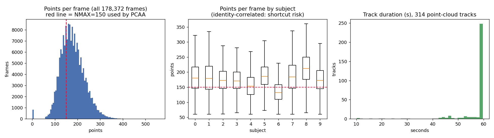
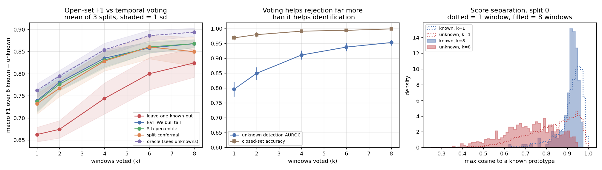
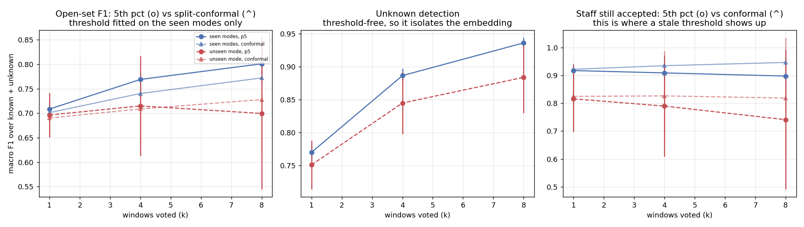
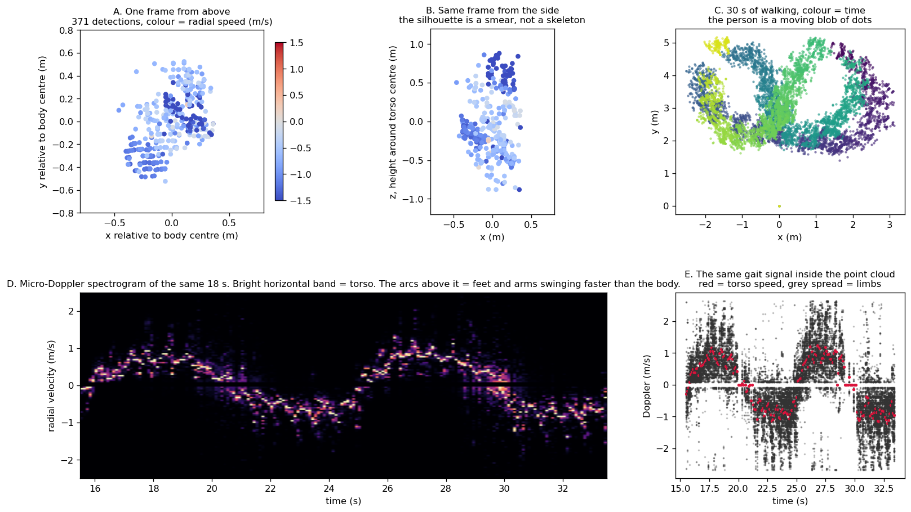

# mmGait10 Open-Set Gait ID

Open-set clinician identification from mmWave radar point clouds, built for the constraints
a real hospital ward actually has: you can enrol staff, but you can never collect labelled
intruders to tune a rejection threshold against.

Built on **mmGait10** (Zenodo [15784474](https://zenodo.org/records/15784474), CC-BY 4.0) - 10
subjects, 3 walking modes, a TI MMWCAS-RF-EVM cascade radar at 77-81 GHz. Reference paper:
Mazzieri, Pegoraro, Rossi, *"Open-Set Gait Recognition from Sparse mmWave Radar Point Clouds,"*
IEEE Sensors Journal 2025 ([DOI](https://doi.org/10.1109/JSEN.2025.3587503),
[code](https://github.com/rmazzier/OpenSetGaitRecognition_PCAA)).

## Why this exists

Most open-set gait recognition work assumes you can validate a rejection threshold against real
impostors. A hospital cannot do that - you can enrol clinicians, but recruiting labelled
intruders to calibrate against is not something you can do on a live ward. This project asks:
**how much do you actually give up by refusing to use impostor data at all**, and finds the
answer is "much less than the field assumes," with three findings that survive independent
scrutiny.

## Three findings

**1. A metadata-only shortcut gets 29.3% accuracy on 10 subjects from cheap summary statistics
alone** (point count, power, Doppler spread - 10% is chance). Point density alone gives 24.4%.
This is body size and radar cross-section, not gait, and it is removed by construction by fixing
every frame at exactly 64 points before training on anything else.

<p align="center"></p>

**2. Impostor-free threshold calibration costs almost nothing.** A plain 5th-percentile of
validation genuine scores lands within 0.03 macro-F1 of an oracle that cheats and sees real
unknown subjects. Extreme-value-theory (Weibull/OpenMax-style) fitting matches the plain
percentile to three decimal places at every operating point - the machinery earns nothing here.
A split-conformal variant of the percentile (same cost, but with an actual finite-sample
guarantee on the false-rejection rate instead of a point estimate) holds up even under a
walking-mode shift the plain percentile does not survive.

<p align="center"></p>

**3. Leave-one-known-out - the obvious impostor-free proxy - fails in the dangerous direction.**
Holding out one enrolled person and treating their score as an "impostor" looks excellent
(97%+ staff kept) because the network was explicitly trained to push enrolled people apart from
each other, so the pseudo-impostor score is nothing like a real stranger's. It actually lets over
half of real intruders through. A system tuned this way would look like it was working and would
not be.

**Bonus - cross-scenario shift is where naive calibration actually breaks.** Training on two
walking styles and testing on a third the system never calibrated against collapses the plain
percentile threshold to 39% staff-kept on the worst holdout, while the embedding underneath
barely notices the shift. Full results and interpretation in [RESULTS.md](RESULTS.md).

<p align="center"></p>

## What one frame of this data actually looks like

<p align="center"></p>

## Results at a glance

Mean over 3 random known/unknown splits. Macro-F1 is over 7 classes: 6 known subjects + "unknown."

| windows voted | seconds | closed-set acc | unknown AUROC | leave-one-known-out | EVT Weibull | 5th-percentile | split-conformal | oracle |
|---|---|---|---|---|---|---|---|---|
| k = 1 | 3 s | 0.968 | 0.795 | 0.662 | 0.739 | 0.736 | 0.732 | 0.762 |
| k = 4 | 6 s | 0.991 | 0.911 | 0.744 | 0.835 | 0.831 | 0.828 | 0.854 |
| k = 8 | 10 s | 0.998 | 0.953 | 0.824 | 0.868 | 0.868 | 0.850 | 0.894 |

Full tables, per-holdout cross-scenario breakdowns, and the interpretation of every number are in
**[RESULTS.md](RESULTS.md)**. The dataset profile, the shortcut audit, and a line-by-line review
of the original reference implementation's bugs are in **[ANALYSIS.md](ANALYSIS.md)**.

## How it works

| Design choice | Why |
|---|---|
| Point cloud input, not micro-Doppler | The only representation that survives more than one person in the room |
| ArcFace metric-learning head, not softmax | Staff are enrolled/removed by editing a gallery of embeddings, not by retraining |
| Threshold calibrated without impostor data | You can enrol clinicians; you cannot collect labelled intruders on a live ward |
| Temporal voting over consecutive windows | A clinician walking bed to bed gives seconds of data, not one frame |

Pipeline: per-frame PointNet (32→64→128, max-pool over points) → 3 dilated temporal conv blocks →
mean+max pool over time → 128-d L2-normalised embedding → ArcFace (scale 16, margin 0.25) over
the known subjects only. Full architecture in [model.py](code/model.py), full calibration methods
in [calib.py](code/calib.py).

## Repo layout

```
code/                everything is run from here
  paths.py           every path derived from this file's location -- move the repo, nothing breaks
  prep.py            raw .obj point clouds -> prepared_64pts.npz (fixed 64 pts/frame, per-frame centred)
  profile_pc.py       per-track statistics -> results/pc_profile.json
  shortcut.py         the metadata-only shortcut floor (finding #1)
  data.py             windowing, augmentation, track-level train/val/test split
  model.py            PointNet frame encoder + temporal conv + ArcFace
  calib.py            five open-set rejection rules: LOKO, EVT, percentile, split-conformal, oracle
  run.py              main open-set experiment
  run_xs.py           cross-scenario experiment (train on 2 walking modes, test on the 3rd)
  aggregate.py         results/runs/*.json -> table + figures/openset_results.png
  aggregate_xs.py      results/runs_xs/*.json -> table + figures/xscenario_results.png
  explain_fig.py       the five-panel radar explainer figure
figures/              generated plots (checked in)
results/              json summaries (checked in); large per-split score/model files are gitignored
ANALYSIS.md           dataset profile, shortcut audit, review of the reference paper's code
RESULTS.md            the open-set experiment: method, full numbers, what they mean, what they don't
```

## Getting started

```bash
pip install -r requirements.txt
```

The raw dataset is not in this repo (it's ~700 MB) - download `mmGait10_v2.zip` from
[Zenodo 15784474](https://zenodo.org/records/15784474) and unzip it to `mmGait10/` at the repo
root, so the layout matches what [paths.py](code/paths.py) expects:

```
<repo root>/
    mmGait10/            <- unzip the Zenodo archive here
        point_clouds/
        spectrograms/
    code/
```

Then, from `code/`:

```bash
python profile_pc.py                                 # per-track stats, numpy only
python shortcut.py                                    # the metadata-only shortcut floor
python explain_fig.py                                 # the five-panel radar explainer figure

python prep.py                                         # raw .obj -> prepared_64pts.npz

python run.py --seed 0 && python run.py --seed 1 && python run.py --seed 2
python aggregate.py                                    # table + figures/openset_results.png

python run_xs.py --holdout free_walk --seed 0          # repeat for hands_in_pockets, smartphone
python aggregate_xs.py                                 # table + figures/xscenario_results.png
```

Profiling and prep need numpy only. Training needs torch and scipy; one split runs in
about 15-25 minutes on a few CPU cores, or minutes on a GPU.

## Caveats, stated plainly

Not comparable to the reference paper's headline number (different openness, point budget, and
split count - see [RESULTS.md](RESULTS.md#what-this-does-not-say)). One room, one radar, one day.
Six enrolled subjects is a tiny gallery. Full list of what these results do and do not support is
in RESULTS.md - read that section before citing any number here.

## License

Code in this repository is MIT-licensed (see [LICENSE](LICENSE)). The mmGait10 dataset itself is
CC-BY 4.0, released by its original authors - cite the paper above if you use it.
