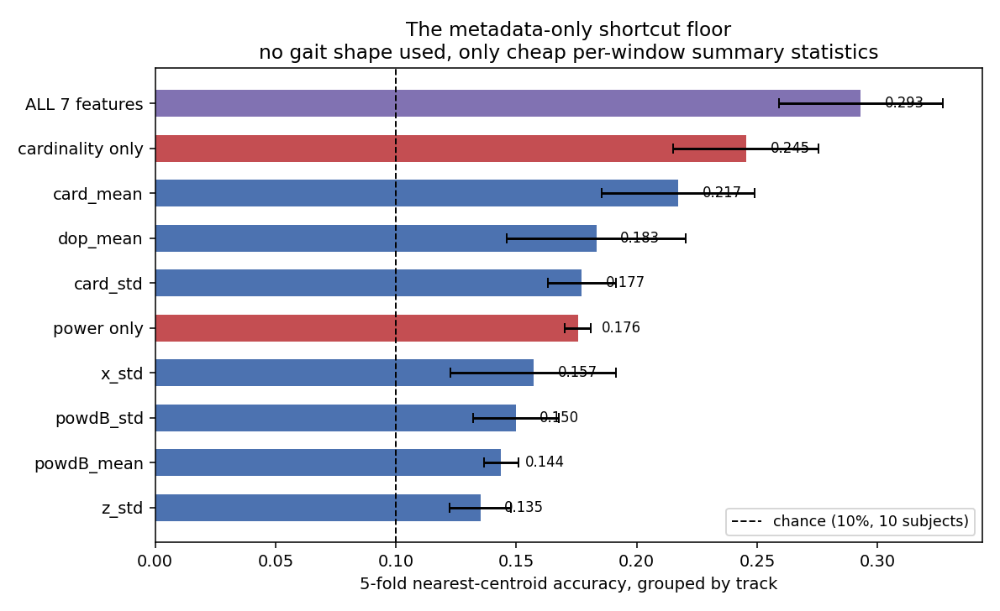
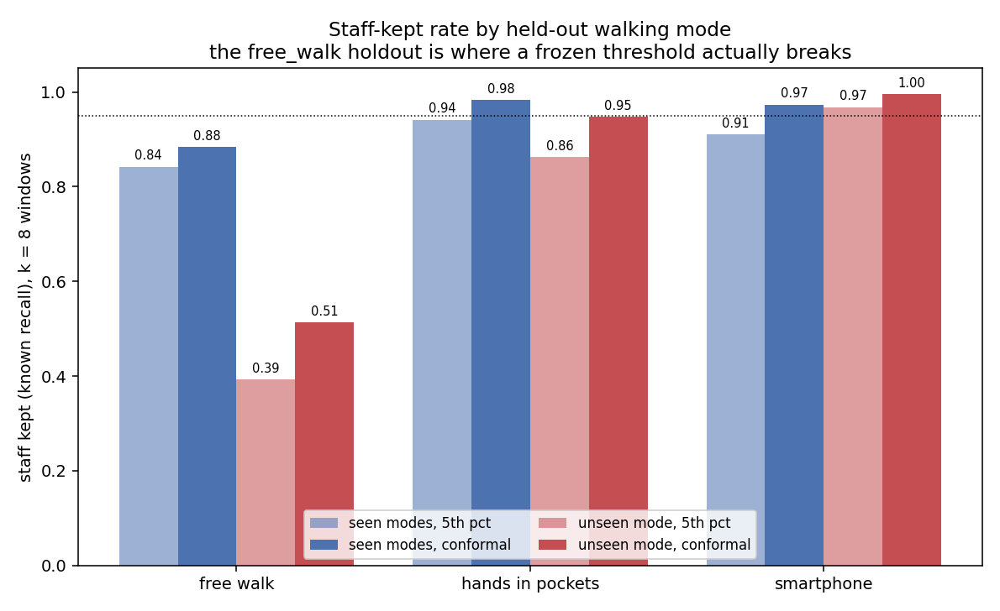

# Open-Set Clinician Identification via Radar Point-Cloud Gait

## 1. Problem Statement

Can a person's walking pattern, captured as a sparse point cloud by a millimeter-wave radar,
identify hospital staff, using a rejection threshold that never requires a labelled intruder. A
hospital can enrol its own clinicians but cannot record labelled strangers to tune against.

Dataset: **mmGait10** (Zenodo 15784474, CC-BY 4.0) [1]. 10 subjects, TI MMWCAS-RF-EVM cascade
radar, 77 to 81 GHz, 3 walking modes (free walk, hands in pockets, smartphone). 314 tracks,
178,372 frames at 10 Hz. 10 subjects is small for any identification task; every result below
should be read against that.

### 1.1 Baseline: What Metadata Alone Can Identify

Nearest-centroid classifier on 7 cheap per-window statistics (point count, power, Doppler, x/z
spread), no gait shape, 5-fold cross-validation grouped by track.

| Feature set | Accuracy | Std |
|---|---|---|
| Chance (10 subjects) | 0.100 | n/a |
| z spread alone | 0.135 | 0.013 |
| Power, mean alone | 0.144 | 0.007 |
| Power, std alone | 0.150 | 0.018 |
| x spread alone | 0.157 | 0.034 |
| Power (2 features) | 0.176 | 0.005 |
| Point-count std alone | 0.177 | 0.014 |
| Doppler magnitude alone | 0.183 | 0.037 |
| Point-count mean alone | 0.217 | 0.032 |
| Point count (2 features) | 0.245 | 0.030 |
| **All 7 metadata features** | **0.293** | 0.034 |

Nearly a third of identity is recoverable from body size and radar reflectivity alone, no gait
model involved. Every frame is forced to exactly 64 points afterward to remove point count as a
per-subject variable by construction (Section 2).

## 2. Data and Preprocessing

| Channel | Role |
|---|---|
| Point cloud (x, y, z, Doppler) | The identity signal, 10 Hz, forced to 64 points/frame |
| Micro-Doppler spectrogram | In the raw dataset, not used here |

| Seed | Known | Unknown | Train windows | Val | Test-known | Test-unknown |
|---|---|---|---|---|---|---|
| 0 | 2,3,4,6,7,9 | 0,1,5,8 | 7,195 | 1,522 | 1,583 | 6,714 |
| 1 | 1,4,5,6,7,9 | 0,2,3,8 | 7,201 | 1,468 | 1,650 | 6,695 |
| 2 | 0,1,5,6,7,8 | 2,3,4,9 | 7,106 | 1,523 | 1,568 | 6,817 |

Split at the whole-track level before windowing (70/15/15 train/val/test), so no window from one
track crosses a split. Unknown subjects appear only at test.

| Step | Method | Why |
|---|---|---|
| Point count fix | Subsample to 64, or resample with replacement if fewer | Removes the Section 1.1 shortcut |
| Per-frame centring | Subtract each frame's own mean (x, y, z, Doppler) | Removes position/bulk speed; body extent survives as real biometry |
| Window | 30 frames (3 s), 10-frame hop | |
| Augmentation (train only) | Yaw +/-15 deg, mirror flip 50%, 15% point dropout | |

## 3. Model

| Component | Structure |
|---|---|
| Frame encoder | Conv1d(4-32-64-128), BatchNorm, ReLU, max-pool over 64 points |
| Temporal | 3 dilated Conv1d blocks (dilation 1, 2, 4), residual |
| Head | Mean+max pool over time, Linear-BN-ReLU-Dropout(0.2)-Linear, 128-d, L2-normalised |
| Classifier | ArcFace, scale 16, margin 0.25, known subjects only |

**259,008 parameters** (258,240 embedding network + 768 ArcFace head for 6 classes), measured
directly. Checkpoint: 1,058,373 bytes. AdamW, lr 2e-3 one-cycle, batch 32, 20 epochs, no early
stopping.

## 4. Closed-Set Results

| k (windows) | Seconds | Closed-set acc | Unknown AUROC |
|---|---|---|---|
| 1 | 3 | 0.968 | 0.795 |
| 2 | 4 | 0.979 | 0.849 |
| 4 | 6 | 0.991 | 0.911 |
| 6 | 8 | 0.993 | 0.937 |
| 8 | 10 | 0.998 | 0.953 |

Identity is settled after one window. Stranger-detection keeps improving to 10 seconds.

## 5. Open-Set Calibration Without Impostor Data

| Method | Impostor data | Idea |
|---|---|---|
| LOKO | No | Hold out one enrolled subject, treat their score as a pseudo-impostor |
| EVT Weibull | No | Peaks-over-threshold fit [2] to the low tail of genuine scores |
| 5th percentile | No | Empirical quantile of validation genuine scores |
| Split-conformal | No | Percentile with a finite-sample false-rejection guarantee [3][4] |
| Oracle | Yes, cheats | Youden's J [5] on real unknown subjects; upper bound only |

Macro-F1 over 7 classes, mean of 3 seeds:

| k | Closed acc | AUROC | LOKO | EVT | 5th pct | Conformal | Oracle |
|---|---|---|---|---|---|---|---|
| 1 | 0.968 | 0.795 | 0.662 | 0.739 | 0.736 | 0.732 | 0.762 |
| 4 | 0.991 | 0.911 | 0.744 | 0.835 | 0.831 | 0.828 | 0.854 |
| 8 | 0.998 | 0.953 | 0.824 | 0.868 | 0.868 | 0.850 | 0.894 |

Staff kept / intruders rejected at k = 8:

| Method | Staff kept | Intruders rejected |
|---|---|---|
| LOKO | 0.985 | 0.544 |
| EVT | 0.881 | 0.836 |
| 5th percentile | 0.881 | 0.836 |
| Split-conformal | 0.927 | 0.669 |
| Oracle | 0.893 | 0.894 |

Gap to the cheating oracle: 0.026 macro-F1 at k = 8. Impostor-free calibration costs little.

## 6. Validation Checks

**EVT vs. percentile.** Matched to 3 decimals at every k. The Weibull fit earns nothing here.

**LOKO fails in the dangerous direction.** Best staff-kept (0.985) but worst intruder-rejection
(0.544): the embedding is trained to push enrolled subjects apart, so a held-out subject's score
is not a real stranger's. Also the highest seed-to-seed variance of any method.

**Percentile overshoots its own target; conformal does not.**

| | Own calibration set | Unseen mode (free_walk) | Unseen mode (smartphone) |
|---|---|---|---|
| 5th percentile | 5.3% rejected (target 5%) | 25.5% rejected | 4.76% rejected |
| Split-conformal | 4.3% rejected | 23.9% rejected | 3.80% rejected |

Single-window scores. The `free_walk` gap shows calibration transfer failing under one specific
walking-mode shift (Section 7), not a general property of either method.

## 7. Cross-Scenario Robustness

Train and calibrate on 2 of 3 walking modes, test on both seen modes and the held-out third.

Staff kept at k = 8:

| Holdout | Seen, 5th pct | Seen, conformal | **Unseen, 5th pct** | **Unseen, conformal** |
|---|---|---|---|---|
| free_walk | 0.842 | 0.883 | **0.393** | **0.513** |
| hands_in_pockets | 0.941 | 0.983 | 0.863 | 0.948 |
| smartphone | 0.910 | 0.973 | 0.968 | 0.995 |

Holding out `free_walk` collapses the plain percentile to 39.3% staff kept, while unknown-AUROC
barely drops (0.936 to 0.884 aggregated). The failure is the frozen threshold, not the embedding.
Split-conformal recovers part of it (39.3% to 51.3%) but does not fix the underlying gap. One
seed per holdout, not 3, so the size of the `free_walk` failure is established but not tightly
bounded.

## 8. Limitations

- 10 subjects is the binding constraint on every number above.
- Not comparable to the original mmGait10 paper's result (different openness, point budget, split count).
- One room, one radar, one day. No cross-session, cross-room, or cross-hardware test.
- No embedding-level confound probe was run; only the raw-metadata shortcut was measured pre-model.
- No early stopping; final-epoch weights used regardless of validation trajectory.
- No test-time noise-robustness evaluation.
- 6 to 8 enrolled subjects is a tiny gallery next to a real ward's staff count.
- Single person, clear line of sight; no multi-person recordings to test the reason point cloud was chosen.

## References

1. Mazzieri, R., Pegoraro, J., Rossi, M. Open-Set Gait Recognition from Sparse mmWave Radar Point
   Clouds. IEEE Sensors Journal (2025). DOI 10.1109/JSEN.2025.3587503.
2. Bendale, A., Boult, T. E. Towards Open Set Deep Networks. CVPR (2016).
3. Vovk, V., Gammerman, A., Shafer, G. Algorithmic Learning in a Random World. Springer (2005).
4. Bates, S., Candes, E., Lei, L., Romano, Y., Sesia, M. Testing for outliers with conformal
   p-values. Annals of Statistics 51(1), 149-178 (2023).
5. Youden, W. J. Index for rating diagnostic tests. Cancer 3(1), 32-35 (1950).
6. Deng, J., Guo, J., Xue, N., Zafeiriou, S. ArcFace: Additive Angular Margin Loss for Deep Face
   Recognition. CVPR (2019).
7. Qi, C. R., Su, H., Mo, K., Guibas, L. J. PointNet: Deep Learning on Point Sets for 3D
   Classification and Segmentation. CVPR (2017).
